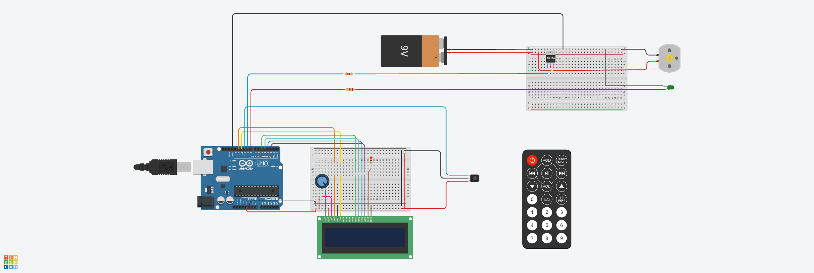

# 🔧 TemperaTu – Temperino Automatico Embedded

## 👤 Autore

**Francesco Emanuele Franguelli**

---

## 📖 Descrizione del progetto

**TemperaTu** è un progetto embedded che realizza un **temperino automatico intelligente**. Utilizza un sensore a infrarossi per rilevare l’inserimento di una matita e attiva automaticamente un motore per iniziare il processo di tempera. Quando la matita viene rimossa, il motore si arresta. Il sistema funziona in **loop chiuso** grazie al feedback continuo del sensore IR.

## 🖥️ Interfaccia utente

### Il sistema fornisce un’interfaccia visiva e informativa per l’utente tramite LED e un display LCD:

- 🟢 **LED Verde** – Indica che il sistema è acceso. Se lampeggia, il motore è in funzione (temperatura in corso).

Inoltre, un **monitor LCD** mostra in tempo reale:

- Il numero di matite temperate
- Il tempo totale di utilizzo del temperino

---

## 🧱 Componenti hardware

| Componente               | Quantità | Descrizione                                  |
| ------------------------ | -------- | -------------------------------------------- |
| ELEGOO Mega 2560 R3      | 1        | Microcontrollore basato su ATmega2560        |
| Sensore Infrarossi (IR)  | 1        | Rilevamento della matita                     |
| Motore (con spazzole DC) | 1        | Movimento della lama del temperamatite       |
| LED (verde)              | 1        | Indicatori di stato                          |
| Monitor LCD 1602         | 1        | Indica le matite temperate e il tempo di uso |
| Resistenze per LED       | 3        | Limitatori di corrente                       |
| Alimentazione 5V o 12V   | 1        | In base al motore scelto                     |
| Breadboard               | 1        | Per prototipazione o montaggio finale        |
| Cavi jumper              | vari     | Collegamenti                                 |

---

## 📦 Dipendenze software

- [LiquidCrystal](https://www.arduino.cc/reference/en/libraries/liquidcrystal/) – Per l’uso del display LCD.

---

## 🔌 Schema del circuito

---

## 🔗 Progetto su Tinkercad

Puoi visualizzare e simulare il progetto direttamente su Tinkercad tramite il seguente link:

👉 [TemperaTu su Tinkercad](https://www.tinkercad.com/things/3OzL5qmVeZx-dazzling-rottis-turing?sharecode=1UdnJYLffYHzwjncRs2r191bbj2PqrZkwVTHTH8IqTM)
